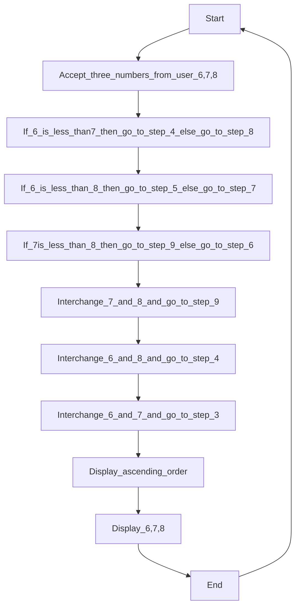

```mermaid
graph TD;
  Start-->Accept_three_numbers_from_user_6,7,8
  Accept_three_numbers_from_user_6,7,8-->If_6_is_less_than7_then_go_to_step_4_else_go_to_step_8
  If_6_is_less_than7_then_go_to_step_4_else_go_to_step_8-->If_6_is_less_than_8_then_go_to_step_5_else_go_to_step_7
  If_6_is_less_than_8_then_go_to_step_5_else_go_to_step_7-->If_7is_less_than_8_then_go_to_step_9_else_go_to_step_6
  If_7is_less_than_8_then_go_to_step_9_else_go_to_step_6-->Interchange_7_and_8_and_go_to_step_9
  Interchange_7_and_8_and_go_to_step_9-->Interchange_6_and_8_and_go_to_step_4
  Interchange_6_and_8_and_go_to_step_4-->Interchange_6_and_7_and_go_to_step_3
  Interchange_6_and_7_and_go_to_step_3-->Display_ascending_order
  Display_ascending_order-->Display_6,7,8
  Display_6,7,8-->End
  End-->Start
```
